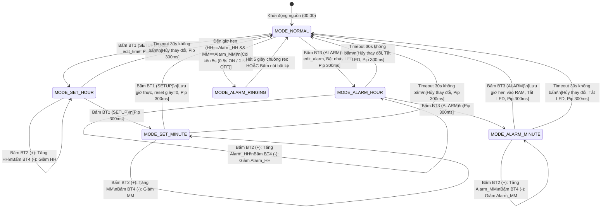

# 🕐 Dự Án Đồng Hồ Số AT89S52 (Digital Clock Application)

**Nền tảng:** Kit AT89S52 V2 (Vi điều khiển Atmel AT89S52, Thạch anh 11.0592 MHz)  
**Trình biên dịch:** SDCC (Small Device C Compiler v4.x+)  
**Trình nạp & Giao tiếp:** avrdude qua mạch nạp USBasp / USBISP  
**Bộ nhớ tối ưu:** Flash ~2.1 KB / 8 KB (26%) | RAM nội ~53 B / 256 B  

---

## 📋 Mục Lục

1. [Giới Thiệu Tổng Quan](#giới-thiệu-tổng-quan)
2. [Ma Trận Tính Năng & Phạm Vi](#ma-trận-tính-năng--phạm-vi)
3. [Phần Cứng & Sơ Đồ Đấu Nối (Kit AT89S52 V2)](#phần-cứng--sơ-đồ-đấu-nối-kit-at89s52-v2)
4. [Kiến Trúc Phần Mềm (Layered Architecture)](#kiến-trúc-phần-mềm-layered-architecture)
5. [Máy Trạng Thái (Finite State Machine)](#máy-trạng-thái-finite-state-machine)
6. [Cấu Trúc Thư Mục Dự Án](#cấu-trúc-thư-mục-dự-án)
7. [Phân Công Công Việc 3 Thành Viên](#phân-công-công-việc-3-thành-viên)
8. [Hướng Dẫn Cài Đặt Môi Trường & Nạp Code](#hướng-dẫn-cài-đặt-môi-trường--nạp-code)
9. [Xử Lý Lỗi Thường Gặp (Troubleshooting)](#xử-lý-lỗi-thường-gặp-troubleshooting)

---

## 1. Giới Thiệu Tổng Quan

Dự án này xây dựng một hệ thống **Đồng hồ số thời gian thực hiển thị Giờ : Phút (HH.MM)**, hỗ trợ tính năng **Cài đặt giờ thực tế (SETUP)** và **Hẹn giờ báo thức (ALARM)** trên phần cứng **Kit AT89S52 V2 New**.

Toàn bộ kiến trúc được kế thừa và chuẩn hóa theo mẫu phân lớp chuyên nghiệp (`MCU_Project/exp12_clock_app`), ứng dụng mô hình lập trình bất đồng bộ đơn nhân **Cooperative Multitasking / Flag-based Super Loop**, loại bỏ hoàn toàn các hàm `delay` gây phong tỏa CPU, đảm bảo hiển thị LED 7 đoạn mượt mà, phản hồi nút nhấn tức thì và nhịp chuông chính xác.

---

## 2. Ma Trận Tính Năng & Phạm Vi

> [!NOTE]
> Căn cứ theo tài liệu đề bài (`ref/MCU-Sonix-Bài-tập-vòng-1-Board-EVK-SN32F407_2026.pdf`) và sơ đồ nguyên lý Kit thực tế (`ref/PRJ KIT AT89S52 V2 NEW 190815.pdf`), các nội dung không tương thích phần cứng được điều chỉnh như sau:
> - **EEPROM I2C:** Do trên board AT89S52 không gắn chip EEPROM ngoài (AT24Cxx) và chip AT89S52 không có EEPROM nội, tính năng lưu trữ EEPROM khi mất điện được chuyển thành lưu trữ trong biến RAM tĩnh trong suốt phiên hoạt động (như yêu cầu của đề bài giao).
> - **Nút bấm:** 4 nút độc lập BT1, BT2, BT3, BT4 trên Port 3 thay thế ma trận phím.

| STT | Tính năng | Mô tả chi tiết | Trạng thái |
| :--- | :--- | :--- | :--- |
| 1 | **Hiển thị HH.MM** | 4 LED 7 đoạn Anode chung hiển thị giờ và phút (`00.00` – `23.59`). Dấu chấm ngăn cách nhấp nháy 1s/lần ở chế độ thường. | Hoàn thành |
| 2 | **Cài đặt giờ (SETUP)** | Nhấn BT1: Chuyển lần lượt qua `Chỉnh Giờ` (HH nháy 0.5s ON / 0.5s OFF) $\rightarrow$ `Chỉnh Phút` (MM nháy) $\rightarrow$ `Lưu & Thoát`. | Hoàn thành |
| 3 | **Hẹn giờ (ALARM)** | Nhấn BT3: Chuyển qua `Chỉnh Giờ Hẹn` (HH nháy) $\rightarrow$ `Chỉnh Phút Hẹn` (MM nháy) $\rightarrow$ `Lưu vào RAM & Thoát`. | Hoàn thành |
| 4 | **Nút Tăng (+)** | Nhấn BT2: Tăng giờ ($0 \rightarrow 23 \rightarrow 0$) hoặc tăng phút ($0 \rightarrow 59 \rightarrow 0$). | Hoàn thành |
| 5 | **Nút Giảm (-)** | Nhấn BT4: Giảm giờ ($23 \leftarrow 0$) hoặc giảm phút ($59 \leftarrow 0$). | Hoàn thành |
| 6 | **Còi báo (Buzzer)** | Phát tiếng bip ngắn 300ms khi ấn phím hoặc khi timeout. Khi đến giờ hẹn, kêu báo thức liên tục trong 5s (chu kỳ 0.5s ON – 0.5s OFF). Nhấn nút bất kỳ để ngắt chuông sớm. | Hoàn thành |
| 7 | **LED báo hẹn giờ** | Đèn LED (P2.4) nhấp nháy chu kỳ 1s (0.5s ON – 0.5s OFF) khi đang ở chế độ chỉnh giờ hẹn. Ở chế độ khác luôn tắt (OFF). | Hoàn thành |
| 8 | **Timeout 30s** | Ở chế độ chỉnh giờ hoặc hẹn giờ, nếu trong 30 giây không có thao tác ấn nút, hệ thống tự động hủy thay đổi, thoát về chế độ thường và phát tiếng bip 300ms cảnh báo. | Hoàn thành |

---

## 3. Phần Cứng & Sơ Đồ Đấu Nối (Kit AT89S52 V2)

Căn cứ sơ đồ nguyên lý chuẩn trong file [PRJ KIT AT89S52 V2 NEW 190815.pdf](file:///C:/Users/84333/projects/dongho/ref/PRJ%20KIT%20AT89S52%20V2%20NEW%20190815.pdf):

```
                       SƠ ĐỒ KHỐI PHẦN CỨNG AT89S52
                   ┌─────────────────────────────────┐
                   │        MCU AT89S52 (DIP-40)     │
                   │      Thạch anh: 11.0592 MHz     │
                   └──────────────┬──────────────────┘
            P1.0 - P1.7           │          P2.0 - P2.3
       (Dữ liệu thanh A..DP)      │        (Chọn vị trí quét Q1..Q4)
             │                    │                     │
             ▼                    │                     ▼
     ┌──────────────┐             │             ┌──────────────┐
     │  RP3 & RP4   │             │             │ 4x PNP A1015 │
     │  Trở đệm bọc │             │             │  (Anode VCC) │
     └──────┬───────┘             │             └──────┬───────┘
            └──────────────┐      │      ┌─────────────┘
                           ▼      ▼      ▼
                      ┌──────────────────────┐
                      │  LED 7 ĐOẠN 4 SỐ     │
                      │   (Common Anode)     │
                      │  [HH_H][HH_L].[MM_H][MM_L]
                      └──────────────────────┘
                   P3.2 - P3.5    │       P3.6           P2.4
             (Nút bấm BT1..BT4)   │   (NPN C1815)     (Alarm LED)
                     │            │        │              │
                     ▼            │        ▼              ▼
                 [4 NÚT NHẤN]     │   [BUZZER CÒI]     [ĐÈN BÁO]
```

### 3.1. Bảng phân bố chân vi điều khiển

| Chân MCU | Tên ngoại vi | Chức năng mạch | Mức logic điều khiển |
| :--- | :--- | :--- | :--- |
| **P1.0** | LED Segment A | Đoạn LED A (LED 7 đoạn) | Mức `0` = Sáng, Mức `1` = Tắt |
| **P1.1** | LED Segment B | Đoạn LED B | Mức `0` = Sáng, Mức `1` = Tắt |
| **P1.2** | LED Segment C | Đoạn LED C | Mức `0` = Sáng, Mức `1` = Tắt |
| **P1.3** | LED Segment D | Đoạn LED D | Mức `0` = Sáng, Mức `1` = Tắt |
| **P1.4** | LED Segment E | Đoạn LED E | Mức `0` = Sáng, Mức `1` = Tắt |
| **P1.5** | LED Segment F | Đoạn LED F | Mức `0` = Sáng, Mức `1` = Tắt |
| **P1.6** | LED Segment G | Đoạn LED G | Mức `0` = Sáng, Mức `1` = Tắt |
| **P1.7** | LED Segment DP | Dấu chấm ngăn cách Giờ - Phút | Mức `0` = Sáng, Mức `1` = Tắt |
| **P2.0** | DIGIT 4 (Q4 PNP) | Chọn LED hàng đơn vị phút (`MM_L`) | Mức `0` = Cấp nguồn, Mức `1` = Khóa |
| **P2.1** | DIGIT 3 (Q3 PNP) | Chọn LED hàng chục phút (`MM_H`) | Mức `0` = Cấp nguồn, Mức `1` = Khóa |
| **P2.2** | DIGIT 2 (Q2 PNP) | Chọn LED hàng đơn vị giờ (`HH_L`) | Mức `0` = Cấp nguồn, Mức `1` = Khóa |
| **P2.3** | DIGIT 1 (Q1 PNP) | Chọn LED hàng chục giờ (`HH_H`) | Mức `0` = Cấp nguồn, Mức `1` = Khóa |
| **P2.4** | ALARM LED | Đèn LED báo đang trong chế độ Hẹn giờ | Mức `0` = Sáng, Mức `1` = Tắt |
| **P3.5** | BT1 (Nút SETUP) | Cài đặt giờ thực tế | Nhả = `1`, Bấm = `0` |
| **P3.4** | BT3 (Nút ALARM) | Cài đặt giờ báo thức | Nhả = `1`, Bấm = `0` |
| **P3.2** | BT2 (Nút UP `+`) | Tăng giá trị giờ/phút | Nhả = `1`, Bấm = `0` |
| **P3.3** | BT4 (Nút DOWN `-`) | Giảm giá trị giờ/phút | Nhả = `1`, Bấm = `0` |
| **P3.6** | BUZZER (Q6 NPN) | Kích còi chip qua transistor C1815 | Mức `1` = Kêu, Mức `0` = Tắt |

### 3.2. Cấu hình Jumper bắt buộc trên Kit
- **Jumper J6 (`VCC - VLED7`):** BẮT BUỘC cắm để cấp nguồn VCC cho 4 transistor PNP A1015 nuôi LED 7 đoạn.
- **Jumper J5 (`VCC - V0SP`):** BẮT BUỘC cắm để cấp nguồn dương cho còi Buzzer.
- **Jumper J7 (`EN_LED`):** Rút ra nếu không muốn 8 LED đơn L1..L8 sáng đè lên đường bus dữ liệu đoạn P1.

---

## 4. Kiến Trúc Phần Mềm (Layered Architecture)

Dự án áp dụng mô hình phân tầng nghiêm ngặt (Strict Layered Architecture). Tầng trên gọi xuống tầng dưới qua API chuẩn, tuyệt đối không có sự phụ thuộc ngược (No Circular Dependency).

```
┌───────────────────────────────────────────────────────────┐
│                       USERAPP LAYER                       │
│  [main.c] - Super Loop, bộ lập lịch cờ ngắt              │
│  [clock_app.c / clock_app.h] - Quản lý FSM & Thời gian   │
└─────────────────────────────┬─────────────────────────────┘
                              │ Gọi hàm API
                              ▼
┌───────────────────────────────────────────────────────────┐
│                       MODULE LAYER                        │
│  [Segment.c/h] - Quét đa công LED 7 đoạn, giải mã chữ số  │
│  [Button.c/h]  - Lọc rung 20ms, phát hiện nhấn đơn        │
│  [Buzzer.c/h]  - Máy trạng thái phát âm thanh phi phong tỏa│
│  [Led.c/h]     - Bật/tắt/đảo LED chỉ báo hẹn giờ          │
└─────────────────────────────┬─────────────────────────────┘
                              │ Gọi hàm trừu tượng hóa I/O
                              ▼
┌───────────────────────────────────────────────────────────┐
│                       DRIVER LAYER                        │
│  [Timer0.c/h]  - Khởi tạo Timer 0, ISR nhịp 1ms & 1s      │
│  [GPIO.c/h]    - Cấu hình và định nghĩa chân phần cứng    │
└─────────────────────────────┬─────────────────────────────┘
                              │ Thao tác thanh ghi SFR
                              ▼
┌───────────────────────────────────────────────────────────┐
│                      HARDWARE / HAL                       │
│  <at89x52.h>   - Header thanh ghi vi điều khiển AT89S52   │
└───────────────────────────────────────────────────────────┘
```

### Nguyên lý Cooperative Multitasking (Flag-based Super Loop)
```c
/* Trình phục vụ ngắt ISR (Timer 0) chỉ làm 1 việc duy nhất: Set cờ báo */
void Timer0_ISR(void) __interrupt(1) {
    // Nạp lại giá trị đếm 1ms
    TH0 = 0xFC; TL0 = 0x66;
    timer_1ms_flag = 1;
    if (++s_ms_counter >= 1000) {
        s_ms_counter = 0;
        timer_1s_flag = 1;
    }
}

/* Vòng lặp chính kiểm tra cờ, xóa cờ TRƯỚC khi gọi task */
while (1) {
    if (timer_1ms_flag) {
        timer_1ms_flag = 0;      /* Xóa cờ ngay lập tức */
        ClockApp_Task_1ms();     /* Quét phím, quét LED, cập nhật còi */
    }
    if (timer_1s_flag) {
        timer_1s_flag = 0;
        ClockApp_Task_1s();      /* Tăng thời gian, đếm timeout 30s */
    }
}
```

---

## 5. Máy Trạng Thái (Finite State Machine)



---

## 6. Cấu Trúc Thư Mục Dự Án

```
at89s52_clock_app/
├── Makefile                    # Kịch bản biên dịch SDCC và nạp code avrdude
├── build.bat                   # File thực thi 1-click build & link trên Windows
├── README.md                   # Tài liệu hướng dẫn toàn diện dự án
├── avrdude.conf                # Cấu hình nạp (đã bổ sung vi điều khiển AT89S52)
└── Source/
    ├── Driver/                 # TẦNG ĐIỀU KHIỂN PHẦN CỨNG (Hardware Abstraction)
    │   ├── GPIO.h              # Định nghĩa địa chỉ chân I/O Port 1, Port 2, Port 3
    │   ├── GPIO.c              # Hàm khởi tạo trạng thái an toàn các chân I/O
    │   ├── Timer0.h            # Cấu hình Timer 0 chu kỳ ngắt 1ms (Thạch anh 11.0592MHz)
    │   └── Timer0.c            # Trình phục vụ ngắt Timer 0 ISR và cờ nhịp
    ├── Module/                 # TẦNG LINH KIỆN NGOẠI VI (Reusable Components)
    │   ├── Segment.h           # Header module hiển thị LED 7 đoạn 4 số
    │   ├── Segment.c           # Bảng mã BCD, quét đa công, triệt tiêu bóng mờ
    │   ├── Button.h            # Header module phím bấm độc lập
    │   ├── Button.c            # Thuật toán chống rung 20ms, bộ lọc sườn nhấn đơn
    │   ├── Buzzer.h            # Header module còi chíp báo động
    │   ├── Buzzer.c            # Máy trạng thái còi non-blocking (pip 300ms, reo 5s)
    │   ├── Led.h               # Header module LED chỉ báo hẹn giờ
    │   └── Led.c               # Bật / tắt / đảo trạng thái LED chỉ báo
    ├── UserAPP/                # TẦNG ỨNG DỤNG NGHIỆP VỤ (Application Logic)
    │   ├── clock_app.h         # Khai báo enum ClockMode_t và API Task 1ms / Task 1s
    │   ├── clock_app.c         # Bộ máy trạng thái FSM, logic đếm giờ, timeout 30s
    │   └── main.c              # Hàm main entry point và vòng lặp Super Loop
    └── Readme/
        └── readme.txt          # Ghi chú kỹ thuật nhanh
```

---

## 7. Phân Công Công Việc 3 Thành Viên

Dự án được chia tách theo các tầng kiến trúc rõ ràng, đảm bảo tính độc lập khi code song song và dễ dàng tích hợp.

### 👤 Thành Viên 1: Hardware & Driver Layer (Trưởng nhóm kỹ thuật)
- **Trách nhiệm chính:**
  - Thiết kế và cấu hình toàn bộ Tầng Driver (`Driver/GPIO.*`, `Driver/Timer0.*`).
  - Tính toán chính xác thông số định thời Timer 0 theo tần số thạch anh thực tế trên kit ($11.0592 \text{ MHz}$, $Reload = 0xFC66$).
  - Thiết lập và tối ưu hệ thống biên dịch `Makefile` và `build.bat` cho công cụ `sdcc` và `packihx`.
  - Cấu hình file `avrdude.conf`, kết nối dây mạch nạp USBasp với hàng chân SPI của AT89S52 (MOSI: P1.5, MISO: P1.6, SCK: P1.7, RST: chân 9).
- **Checklist công việc cần nộp:**
  - [x] Tạo file [GPIO.h](file:///C:/Users/84333/projects/dongho/at89s52_clock_app/Source/Driver/GPIO.h) & [GPIO.c](file:///C:/Users/84333/projects/dongho/at89s52_clock_app/Source/Driver/GPIO.c) với đầy đủ định nghĩa chân.
  - [x] Tạo file [Timer0.h](file:///C:/Users/84333/projects/dongho/at89s52_clock_app/Source/Driver/Timer0.h) & [Timer0.c](file:///C:/Users/84333/projects/dongho/at89s52_clock_app/Source/Driver/Timer0.c) với ngắt Timer 0 chuẩn 1ms.
  - [x] Tạo file [Makefile](file:///C:/Users/84333/projects/dongho/at89s52_clock_app/Makefile) và [build.bat](file:///C:/Users/84333/projects/dongho/at89s52_clock_app/build.bat) tự động hóa quá trình sinh file `.hex`.
  - [x] Đo kiểm thực tế: Tần số ngắt đạt chuẩn 1000 Hz, thời gian đo bằng dao động ký hoặc LED toggle đạt sai số < 0.1%.

---

### 👤 Thành Viên 2: Module Layer & Hardware Abstraction
- **Trách nhiệm chính:**
  - Hiện thực và kiểm thử Tầng Module (`Module/Segment.*`, `Module/Button.*`, `Module/Buzzer.*`, `Module/Led.*`).
  - Xây dựng giải thuật quét LED 4 số đa công thời gian (`Digital_Scan`), áp dụng kỹ thuật "Blanking trước khi đổi chân" để triệt tiêu hoàn toàn hiện tượng bóng mờ giữa các số.
  - Xây dựng thuật toán lọc chống rung phím bấm phần mềm (Software Debounce 20ms), bắt sự kiện sườn xuống (Falling edge) để mỗi lần ấn nút chỉ sinh 1 sự kiện duy nhất (`Button_GetKey`).
  - Xây dựng máy trạng thái còi Buzzer non-blocking (`Buzzer_Task_1ms`), hỗ trợ tiếng kêu bíp 300ms và tiếng chuông báo thức ngắt quãng 500ms ON / 500ms OFF kéo dài đúng 5 giây.
- **Checklist công việc cần nộp:**
  - [x] Module [Segment.h](file:///C:/Users/84333/projects/dongho/at89s52_clock_app/Source/Module/Segment.h) & [Segment.c](file:///C:/Users/84333/projects/dongho/at89s52_clock_app/Source/Module/Segment.c): Đủ bảng mã 0-9, hàm format giờ phút, hàm ẩn số để nhấp nháy.
  - [x] Module [Button.h](file:///C:/Users/84333/projects/dongho/at89s52_clock_app/Source/Module/Button.h) & [Button.c](file:///C:/Users/84333/projects/dongho/at89s52_clock_app/Source/Module/Button.c): Chống rung 4 nút BT1, BT2, BT3, BT4 mượt mà.
  - [x] Module [Buzzer.h](file:///C:/Users/84333/projects/dongho/at89s52_clock_app/Source/Module/Buzzer.h) & [Buzzer.c](file:///C:/Users/84333/projects/dongho/at89s52_clock_app/Source/Module/Buzzer.c): Hoàn toàn phi phong tỏa, không dùng lệnh delay.
  - [x] Module [Led.h](file:///C:/Users/84333/projects/dongho/at89s52_clock_app/Source/Module/Led.h) & [Led.c](file:///C:/Users/84333/projects/dongho/at89s52_clock_app/Source/Module/Led.c): Điều khiển LED chỉ báo hẹn giờ.

---

### 👤 Thành Viên 3: Application Layer & System Integration (Quản lý dự án)
- **Trách nhiệm chính:**
  - Thiết kế và hoàn thiện toàn bộ Tầng Ứng Dụng (`UserAPP/clock_app.*`, `UserAPP/main.c`).
  - Xây dựng cỗ máy trạng thái (FSM) xử lý 6 chế độ hoạt động (`ClockMode_t`), kết nối các sự kiện nút nhấn với việc chuyển đổi trạng thái hiển thị và còi.
  - Triển khai logic đếm đồng hồ thời gian thực (Giây $\rightarrow$ Phút $\rightarrow$ Giờ) và hiệu ứng nhấp nháy 0.5s ON / 0.5s OFF khi đang ở các chế độ cài đặt.
  - Quản lý bộ đếm ngược Timeout 30 giây tự động thoát về `MODE_NORMAL` khi người dùng không thao tác.
  - Tích hợp tổng thể hệ thống, chạy thử nghiệm kiểm thử các ca sử dụng (Test Cases) theo yêu cầu đề bài, ghi lại video demo và chuẩn bị tài liệu báo cáo nghiệm thu.
- **Checklist công việc cần nộp:**
  - [x] Hoàn thiện máy trạng thái trong [clock_app.c](file:///C:/Users/84333/projects/dongho/at89s52_clock_app/Source/UserAPP/clock_app.c) và [clock_app.h](file:///C:/Users/84333/projects/dongho/at89s52_clock_app/Source/UserAPP/clock_app.h).
  - [x] Tích hợp vòng lặp Super Loop trong [main.c](file:///C:/Users/84333/projects/dongho/at89s52_clock_app/Source/UserAPP/main.c).
  - [x] Biên dịch toàn dự án thành công không có lỗi (Zero Error).
  - [x] Thực hiện bảng kịch bản kiểm thử (Test Matrix) đạt 100% tiêu chí.

---

## 8. Hướng Dẫn Cài Đặt Môi Trường & Nạp Code

### 8.1. Cài đặt công cụ phần mềm

#### 1. Trình biên dịch SDCC (Small Device C Compiler)
- **Tải về:** [https://sdcc.sourceforge.net/](https://sdcc.sourceforge.net/) (Khuyến nghị phiên bản $\ge 4.2.0$).
- **Cài đặt:** Chạy bộ cài đặt Windows `.exe`. Khi cài đặt, tích chọn **"Add SDCC to PATH"**.
- **Kiểm tra cài đặt:** Mở terminal PowerShell và gõ:
  ```powershell
  sdcc --version
  ```
  Kết quả hiển thị `SDCC : mcs51/...` là đã thành công.

#### 2. Trình nạp avrdude & Cấu hình Driver USBasp
- **Cài đặt avrdude:** Tải avrdude cho Windows hoặc cài thông qua MSYS2 (`pacman -S mingw-w64-x86_64-avrdude`) hoặc WinAVR.
- **Cài đặt Driver USBasp (Quan trọng):**
  1. Cắm mạch nạp USBasp vào cổng USB máy tính.
  2. Tải phần mềm **Zadig** tại [https://zadig.akeo.ie/](https://zadig.akeo.ie/).
  3. Mở Zadig $\rightarrow$ chọn menu **Options** $\rightarrow$ tích vào **List All Devices**.
  4. Chọn thiết bị **USBasp** trong danh sách thả xuống.
  5. Ở ô Driver mục tiêu, chọn **libusb-win32** (hoặc **WinUSB**) $\rightarrow$ Nhấn **Replace Driver** (hoặc **Install Driver**).

---

### 8.2. Các lệnh Biên dịch & Nạp chương trình

Dự án hỗ trợ 2 phương thức build thuận tiện:

#### Cách 1: Sử dụng Make (Khuyến nghị)
Di chuyển vào thư mục dự án `at89s52_clock_app`:
```bash
# 1. Biên dịch toàn bộ dự án và tạo file clock_app.hex
make

# 2. Kiểm tra kết nối với vi điều khiển AT89S52 qua USBasp
make check

# 3. Nạp file HEX vào vi điều khiển AT89S52
make flash

# 4. Xóa các file trung gian trong thư mục build
make clean
```

#### Cách 2: Sử dụng file thực thi 1-click `build.bat` (Windows)
Chỉ cần nhấp đúp chuột vào file `build.bat` hoặc gõ trong terminal:
```cmd
build.bat
```
Script sẽ tự động biên dịch lần lượt 8 file `.c`, liên kết và xuất ra file `build\clock_app.hex`.

Sau đó thực hiện nạp code bằng câu lệnh:
```cmd
avrdude -C ..\avrdude.conf -c usbasp -p 89s52 -U flash:w:build\clock_app.hex:i
```

---

## 9. Xử Lý Lỗi Thường Gặp (Troubleshooting)

### 1. Lỗi `avrdude: error: could not find USB device "USBasp"`
- **Nguyên nhân:** Máy tính chưa nhận diện đúng driver của mạch nạp USBasp.
- **Khắc phục:** Mở phần mềm Zadig, chọn USBasp và cài đặt lại driver **libusb-win32** (v1.2.6.0).

### 2. Lỗi `avrdude: error: programm enable: target doesn't answer. 1`
- **Nguyên nhân:**
  - Dây cắm ISP bị lỏng hoặc đấu sai chân giữa USBasp và AT89S52 (MOSI, MISO, SCK, RST, VCC, GND).
  - Vi điều khiển chưa có thạch anh hoặc thạch anh 11.0592MHz tiếp xúc không tốt.
  - Mạch nạp phát xung SCK quá nhanh so với tốc độ chip AT89S52.
- **Khắc phục:**
  - Kiểm tra lại các kết nối dây ISP theo sơ đồ chân vi điều khiển AT89S52.
  - Nối chân Jumper `Slow SCK` (JP3) trên mạch nạp USBasp, hoặc thêm tùy chọn `-B 10` vào dòng lệnh avrdude:
    ```bash
    avrdude -C ..\avrdude.conf -c usbasp -p 89s52 -B 10 -U flash:w:build/clock_app.hex:i
    ```

### 3. Lỗi LED 7 đoạn không sáng hoặc sáng mờ, còi không kêu
- **Nguyên nhân:** Chưa cắm Jumper cấp nguồn trên Kit AT89S52 V2.
- **Khắc phục:**
  - Cắm Jumper **J6** để cấp nguồn dương cho 4 transistor PNP nuôi LED 7 đoạn.
  - Cắm Jumper **J5** để cấp nguồn cho còi Buzzer.
  - Rút Jumper **J7** (`EN_LED`) để tránh xung đột chân P1 với dàn 8 LED đơn.

### 4. Lỗi `No rule to make target` khi chạy make
- **Khắc phục:** Chạy `make clean` rồi chạy lại `make`, hoặc sử dụng file `build.bat` đi kèm.
